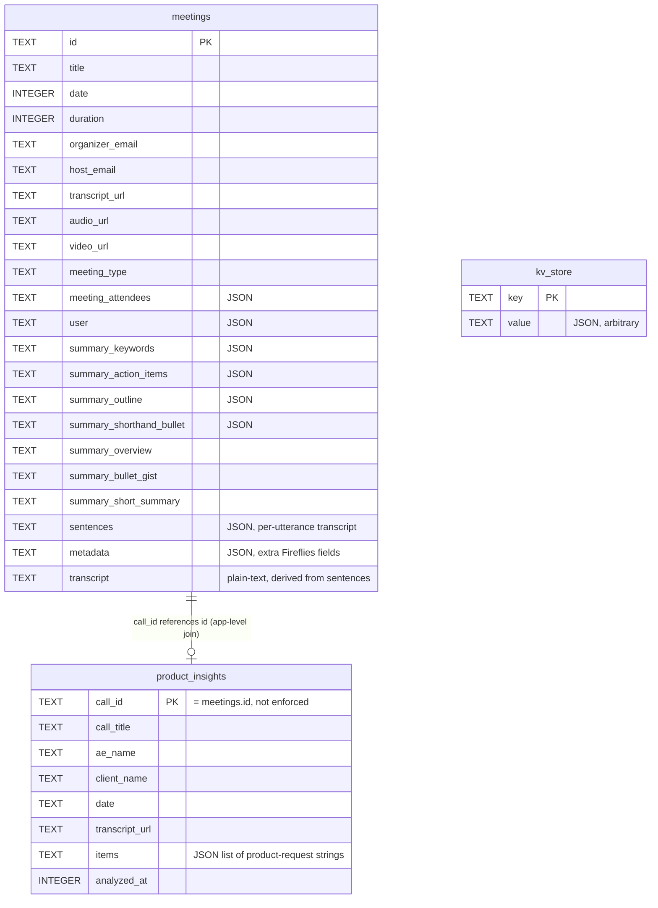
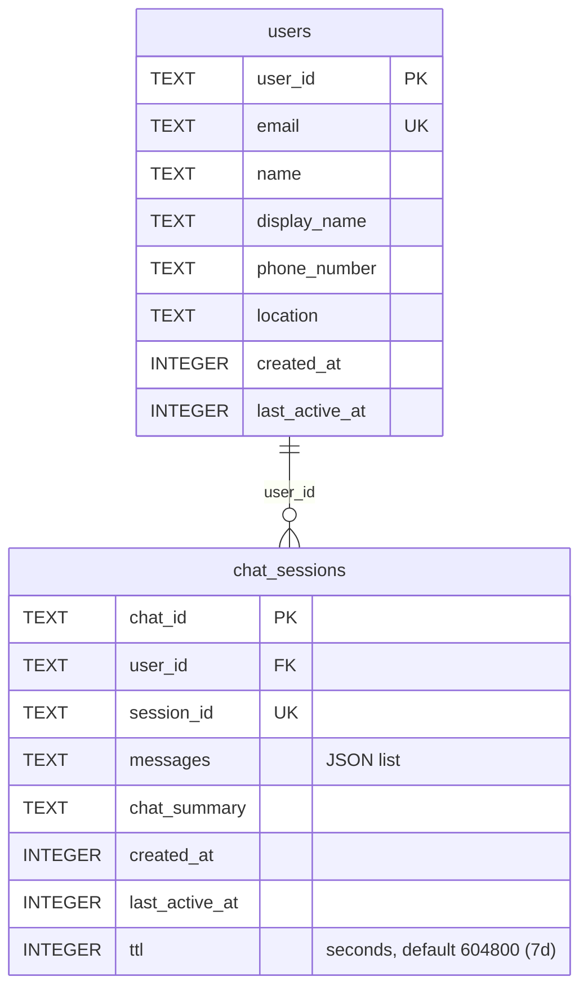
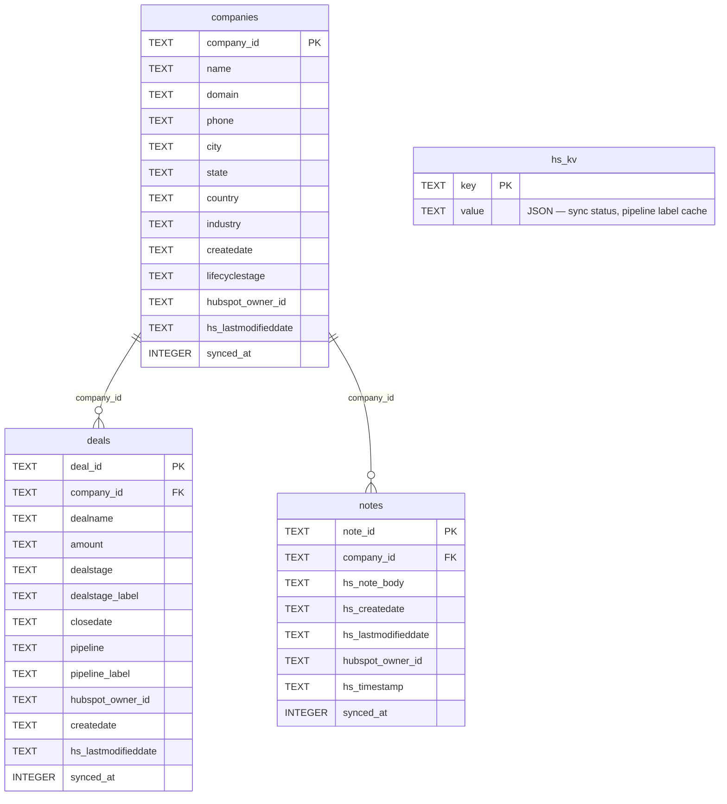

# Database Architecture

Merlin's backend persists data in **four independent SQLite databases**, each owned by its
own module under `db/`. There is no cross-database foreign key enforcement (SQLite can't do
that across separate files) — joins across databases happen in Python, by matching on shared
ID values (`call_id`, `company_id`) after reading from each DB independently.

| Database file | Module | Purpose |
|---|---|---|
| `data/merlin.sqlite` | `db/merlin_db.py` | Fireflies call/meeting records, product-request insights, misc key-value config |
| `data/analytical.sqlite` | `db/analytical_db.py` | Pre-computed dashboard/insights aggregates (summary stats, trends, rankings) |
| `data/chat.sqlite` | `db/chat_db.py` | App users and their chat sessions/history |
| `data/hubspot_data.sqlite` | `db/hubspot.py` | Normalized mirror of HubSpot CRM data (companies, deals, notes) |

All four modules share the same connection pattern:
- A single module-level `sqlite3.Connection` (`_conn`), created lazily on first use via `_get_conn()`.
- `check_same_thread=False` + a module-level `threading.Lock()` guarding every read/write — the connection is shared across FastAPI's threadpool, not per-request.
- `row_factory = sqlite3.Row` for dict-like column access.
- `PRAGMA journal_mode = WAL`, `synchronous = NORMAL`, `temp_store = MEMORY`, and a tuned `cache_size` — set once per connection at open time.
- Schema is created idempotently via `CREATE TABLE IF NOT EXISTS` in `_init_schema()`, called the first time `_get_conn()` opens the file.
- A `close_*_db()` function for clean shutdown, wired into `main.py`'s FastAPI `lifespan`.

**Path resolution** (`config/config.py`): all paths default to `<backend>/data/<name>.sqlite`,
overridable via `SQLITE_PATH` / `ANALYTICAL_PATH` / `CHAT_PATH` / `HUBSPOT_PATH` env vars. Under
AWS Lambda (`IS_LAMBDA`, detected via `AWS_LAMBDA_FUNCTION_NAME`), the default directory switches
to `/tmp/data` instead, since the deployment package itself is read-only there. `/tmp` is ephemeral
per execution environment — data does not persist across cold starts in that mode.

---

## 1. `merlin.sqlite` — calls & product insights

- **`meetings`** — one row per Fireflies call. Most JSON-ish fields (`summary_*`, `sentences`,
  `metadata`, `meeting_attendees`, `user`) are stored as serialized JSON text and deserialized on
  read by `_row_to_meeting()`. `transcript` is derived text built from `sentences` at write time
  (`_meeting_to_row()`), with a one-time backfill migration in `_init_schema()` for rows that
  predate that column. Indexed on `date DESC` for the dashboard's default sort.
  - `get_all_meetings_light()` skips the (large) `sentences` column and is backed by an
    **in-process cache** (`_light_cache`) invalidated on every `upsert_meetings()`/`delete_meetings()`.
    This cache is per-process — it will not stay in sync across multiple workers/Lambda instances
    without going back to the DB, but within a single process it turns list/dashboard reads from a
    full-table scan into a cache hit.
- **`product_insights`** — one row per call, storing the LLM-extracted product-request items for
  that call (`items`, JSON list of strings). Joined with `meetings` in `get_all_product_insights()`
  via a SQL `LEFT JOIN` on `call_id = meetings.id` (this is the one place a join *is* expressed in
  SQL, since both tables live in the same file) to pull in `summary_bullet_gist`/`summary_short_summary`.
- **`kv_store`** — generic key/value JSON blob table. Used for `sync:status` (last Fireflies sync
  timestamp/counts) and API key config values (`config:fireflies_api_key`, etc.), via `kv_get`/`kv_set`/`kv_del`.

---

## 2. `analytical.sqlite` — pre-computed insights

```mermaid
erDiagram
    summary {
        INTEGER id PK "always 1, singleton row"
        INTEGER total_calls
        INTEGER unique_topics
        INTEGER active_aes
        INTEGER total_action_items
        INTEGER positive_sentiment
        INTEGER neutral_sentiment
        INTEGER negative_sentiment
        INTEGER computed_at
    }
    calls_by_day {
        TEXT day PK "Sun..Sat"
        INTEGER count
        INTEGER computed_at
    }
    top_topics {
        TEXT topic PK
        INTEGER count
        TEXT call_ids "JSON list, references meetings.id"
        INTEGER computed_at
    }
    top_aes {
        TEXT ae_name PK
        TEXT ae_email
        INTEGER call_count
        INTEGER computed_at
    }
    call_action_items {
        TEXT call_id PK "= meetings.id"
        TEXT call_title
        TEXT ae_name
        TEXT ae_email
        INTEGER date_ts
        TEXT transcript_url
        TEXT action_items "JSON"
        INTEGER computed_at
    }
    product_analysis {
        TEXT uuid PK "= meetings.id"
        TEXT analysis_dt
        TEXT call_title
        TEXT ae_name
        TEXT date
        TEXT summary_bullet_gist
        TEXT short_summary
    }
    marketing_analytics {
        INTEGER id PK "always 1, singleton row — placeholder"
        TEXT data "JSON, shape undefined"
        INTEGER computed_at
    }
    sales_analytics {
        INTEGER id PK "always 1, singleton row — placeholder"
        TEXT data "JSON, shape undefined"
        INTEGER computed_at
    }
    product_analytics {
        INTEGER id PK "always 1, singleton row — not yet written to"
        TEXT keyword_ranking "JSON"
        TEXT keyword_trending "JSON"
        INTEGER computed_at
    }
    founders_analytics {
        INTEGER id PK "always 1, singleton row — not yet written to"
        INTEGER key_initiators
        TEXT call_sentiment_trending "JSON"
        TEXT competitors_trend "JSON"
        INTEGER computed_at
    }
```

- **`process_analytics(meetings)`** is the single write path for `summary`, `calls_by_day`,
  `top_topics`, `top_aes`, and `call_action_items`. It's called after every Fireflies sync
  (`sync_all_calls`/`sync_new_calls` in `interface/handler.py`) and derives everything from the
  in-memory `meetings` list passed in (sentiment via keyword scoring, topics from
  `summary.keywords`, day-of-week bucketing, etc.). `top_topics` and `top_aes` are fully
  `DELETE`d and re-inserted each run (not upserted) — they represent a full recompute, not an
  incremental one.
- **`get_analytics()`** is the single read path (backs the frontend's `/analytics` endpoint and
  the `Analytics` type in `data-context.tsx`) — it assembles `summary` + `callsByDay` + `topTopics`
  + `topAEs` + `callActionItems` into one payload.
- **`product_analysis`** is a *separate* concept from `product_insights` (in `merlin.sqlite`) and
  from the `product_analytics` table below — it stores a lighter per-call summary snapshot
  (`summary_bullet_gist`, `short_summary`) used for analytics display, upserted via
  `upsert_product_analysis()`.
- **`marketing_analytics` / `sales_analytics` / `product_analytics` / `founders_analytics`** —
  added to support the frontend's Product/Marketing/Founders/Sales insight tabs
  (`insights-page.tsx`). **Only the table shells exist** — there is currently no
  read/write code in `analytical_db.py` that populates or queries them (no `upsert_*`/`get_*`
  functions for any of the four). `marketing_analytics`/`sales_analytics` are generic
  `id`+`data` JSON-blob placeholders since their shape isn't decided yet (see `schema.py` notes
  below); `product_analytics`/`founders_analytics` have concrete columns but nothing writes to
  them yet — the frontend's Product tab currently derives everything itself client-side from
  `topTopics`/`calls` rather than reading a `product_analytics` row.

---

## 3. `chat.sqlite` — users & chat sessions

- The only database with a real `FOREIGN KEY`-shaped relationship expressed *within* the same
  file (`chat_sessions.user_id → users.user_id`), though it's not declared as an actual SQL
  `FOREIGN KEY` constraint — just an application-level join, indexed via
  `idx_chat_sessions_user_id`.
- `upsert_user()` does an update-if-exists-else-insert by `email` (not by `user_id`), generating a
  new UUID only on first sight of that email.
- `ttl` is stored but not currently enforced by any cleanup/expiry job in this file — expiry
  would need to be checked by a caller comparing `last_active_at + ttl` against now.

---

## 4. `hubspot_data.sqlite` — HubSpot CRM mirror

- Normalized 1-company-to-many-deals/notes shape, indexed on `deals.company_id` and
  `notes.company_id`. This is the **only** database with real cross-table joins expressed in SQL
  application logic (`get_hubspot_flat_data()` groups `deals`/`notes` by `company_id` in Python
  after two separate `SELECT`s, rather than a SQL `JOIN`, to build one row per company for the
  frontend table).
- **Legacy migration**: `_migrate_old_flat_table()` runs on every schema init and, if it finds a
  pre-existing flat `hubspot_data` table (the old single-table design), copies it into the three
  normalized tables via `INSERT OR IGNORE ... SELECT`, one time. Safe to run repeatedly — it
  no-ops once `hubspot_data` is gone or already migrated.
- **`dealstage_label`/`pipeline_label`**: raw HubSpot stage/pipeline IDs are opaque; these two
  columns cache the human-readable labels resolved from the Pipelines API
  (`get_hubspot_pipelines()` → `label_map`). `_migrate_add_deal_labels()` adds these columns via
  `ALTER TABLE` for DBs created before they existed. `backfill_deal_labels()` re-resolves labels
  for existing rows when the label map changes.
- **`hs_kv`** — same generic pattern as `merlin.sqlite`'s `kv_store`, scoped to HubSpot: stores
  `hubspot:sync_status` and `hubspot:pipeline_labels` (the label cache above).
- **`get_hubspot_flat_data()`** is the read path that powers the frontend's unified HubSpot table
  (`HubspotData` shape, see below) — one row per company with its *primary* deal (most recent by
  close/create date) and *most-recent* note flattened onto the row, plus `all_deals`/`all_notes`
  arrays for the detail modal.

---

## 5. `schema.py` — Pydantic models

`schema.py` is **not** a single source of truth that the SQLite schemas are generated from — it's
a mix of three distinct roles, and they don't all map onto tables the same way:

1. **App-level record schemas** — `UserSchema`, `ChatSessionSchema`. These roughly mirror
   `chat.sqlite`'s `users`/`chat_sessions` tables (field names match), but the actual table DDL in
   `chat_db.py` is hand-written independently, not generated from these models.
2. **HubSpot API-shape mirrors** — `HubspotDealProperties`/`HubspotDeals`,
   `HubspotNoteProperties`/`HubspotNotes`, `HubspotCompanyProperties`/`HubspotCompanyAssociations`/
   `HubspotCompanies`. These describe the *raw HubSpot API response shape* (`properties` sub-object,
   `createdAt`/`updatedAt`/`archivedAt`, `associations`), not the normalized SQLite tables — they
   exist for typing/validating API responses, not persistence.
3. **Flattened read-model** — `HubspotData` matches `get_hubspot_flat_data()`'s output shape
   almost field-for-field (`company_*`, `deal_*`, `note_*`, `all_deals`, `all_notes`) — this one
   *does* correspond directly to what the DB layer returns, even though the table itself is three
   normalized tables under the hood.
4. **Analytics models** — `Toptopics`, `ProductAnalytics`, `TopAES`, `FoundersAnalytics`, plus
   commented-out `MarketingAnalytics`/`SalesAnalytics` stubs. These are **aspirational/in-progress**
   and don't line up 1:1 with the actual `analytical.sqlite` tables yet:
   - `Toptopics` (topic/count/call_ids/computed_at) matches the real `top_topics` table columns.
   - `TopAES` matches the real `top_aes` table columns.
   - `ProductAnalytics.trending_topics: list[Toptopics]` — but `product_analytics` (the table) has
     no `trending_topics` column; that data actually lives in the separate `top_topics` table.
     `keyword_ranking`/`keyword_trending` *do* match `product_analytics`'s columns, but nothing
     writes to them yet.
   - `FoundersAnalytics.top_aes: list[TopAES]` — same situation: `founders_analytics` (the table)
     has no `top_aes` column; that data lives in the separate `top_aes` table. `key_initiators`,
     `call_sentiment_trending`, `competitors_trend` do match the table's columns.
   - `MarketingAnalytics`/`SalesAnalytics` are still fully commented out — no fields defined at
     all — which is why `marketing_analytics`/`sales_analytics` are generic `data TEXT` JSON blobs
     rather than typed columns; there's nothing yet to type them against.

**Takeaway for future work**: if `product_analytics`/`founders_analytics` are meant to be
single-row denormalized snapshots that *include* the trending-topics/top-AEs lists inline (per
the Pydantic models), the tables need `trending_topics`/`top_aes` JSON columns added, and a
write path needs to be built (nothing currently calls `INSERT`/`UPDATE` on any of the four new
tables). Alternatively, if the intent is to keep `top_topics`/`top_aes` as the single source of
truth and have `product_analytics`/`founders_analytics` hold only the fields not already covered
there, the Pydantic models should drop `trending_topics`/`top_aes` to match.

---

## Quick reference: which table backs which frontend data

| Frontend consumes | Backend endpoint | DB table(s) |
|---|---|---|
| Calls Library (Fireflies tab) | `GET /calls`, `GET /calls/{id}` | `merlin.sqlite: meetings` |
| Calls Library (HubSpot tab) | `GET /hubspot/flat-data` | `hubspot_data.sqlite: companies, deals, notes` |
| Dashboard stat cards, topics, AEs, action items | `GET /analytics` | `analytical.sqlite: summary, calls_by_day, top_topics, top_aes, call_action_items` |
| Product Requests page | `GET /product-insights` | `merlin.sqlite: product_insights` (joined with `meetings`) |
| Insights → Product tab | *(computed client-side from `/analytics` + `/data`)* | `analytical.sqlite: top_topics` (via `topTopics`), `merlin.sqlite: meetings` (via `calls`) — **not** `product_analytics` |
| Insights → Marketing/Founders/Sales tabs | *(placeholder "coming soon" UI)* | none yet — `marketing_analytics`/`sales_analytics`/`founders_analytics` tables exist but are unused |
| Chat sessions (if/when wired into UI) | `GET/POST/PUT/DELETE /chat/sessions*` | `chat.sqlite: users, chat_sessions` |
